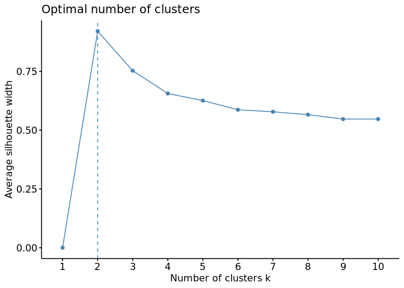

Data science case for Game Studio Technical Interview
================

-   <a href="#1-case-summary" id="toc-1-case-summary">1 Case Summary</a>
-   <a href="#2-data-preparation-preprocessing-and-exploration"
    id="toc-2-data-preparation-preprocessing-and-exploration">2 Data
    preparation, preprocessing, and exploration</a>
    -   <a href="#21-activitycsv" id="toc-21-activitycsv">2.1
        <code>activity.csv</code></a>
    -   <a href="#22-telemetrycsv" id="toc-22-telemetrycsv">2.2
        <code>telemetry.csv</code></a>
    -   <a href="#23-joining-tables" id="toc-23-joining-tables">2.3 Joining
        tables</a>
-   <a href="#3-predicting-churn" id="toc-3-predicting-churn">3 Predicting
    Churn</a>
    -   <a href="#31-defining-churn" id="toc-31-defining-churn">3.1 Defining
        Churn</a>
-   <a href="#4-summary" id="toc-4-summary">4 Summary</a>
    -   <a href="#41-provided-datasets" id="toc-41-provided-datasets">4.1
        Provided Datasets</a>
    -   <a href="#42-model-performance" id="toc-42-model-performance">4.2 Model
        Performance</a>
    -   <a href="#43-indicators-of-churn" id="toc-43-indicators-of-churn">4.3
        Indicators of churn</a>
-   <a href="#5-extra-clustering" id="toc-5-extra-clustering">5 Extra:
    Clustering</a>
    -   <a href="#51-principal-component-analyses"
        id="toc-51-principal-component-analyses">5.1 Principal Component
        Analyses</a>
    -   <a href="#52-k-means-clustering" id="toc-52-k-means-clustering">5.2
        K-means Clustering</a>
    -   <a href="#53-clustering-summary" id="toc-53-clustering-summary">5.3
        Clustering Summary:</a>

# 1 Case Summary

> You are working as an embedded data scientist for a popular strategy
> game. Your game director approaches you and says that while sales for
> the game are meeting KPI targets, some of the engagement KPIs for the
> game are declining quickly and rapidly. Your assignment is to run an
> analysis on the data provided to identify the gameplay behaviors that
> most strongly predict churn. Send us a report with your findings and
> supporting plots, making recommendations for what the game should
> implement and any further analysis you think would be valuable.

# 2 Data preparation, preprocessing, and exploration

For both data-sets, I will be: cleaning column names, removing empty
columns/rows, and identifying and removing duplicate entries in tables.

## 2.1 `activity.csv`

Read this table into R, and clean it up a bit.

``` r
activity <- read.csv("../activity.csv", header = T) %>%
    clean_names() %>%
    remove_empty(c("rows", "cols"))
```

Are there duplicate entries for user activity?

``` r
activity %>%
    get_dupes(user_id, start_time, final_play) %>%
    nrow()
```

    ## [1] 10214

Yes, there is a large number of duplicate rows! Multiple entries have
been included for the same user, with identical `start_time` and
`final_play`, only the `total_seconds_played` is different between these
entries. To me, this either indicates that there is something wrong with
the telemetry tool (this data shouldn’t have been included) or there is
data missing that would have to distinguish the different entries for a
user (i.e. data from separate play sessions).

For now, I have decided to keep a single entry for each user, keeping
the one with the most recent information, the greater number of
`total_seconds_played`. Otherwise, this duplicate data would present a
huge bias!

Update the existing `activity` dataframe.

``` r
activity<-activity %>%
  group_by(user_id,start_time,final_play) %>% # group by the same variables used to identify the duplicate rows
  slice_max(order_by = total_seconds_played,n = 1,with_ties = FALSE) %>% # only keep the row with the highest `total_seconds_played`, important to set `with_ties = FALSE`.
  ungroup()

activity %>% get_dupes(user_id,start_time,final_play) %>% nrow() # check to make sure cleaning worked...
```

    ## [1] 0

Now that we have cleaned this data and removed duplicate entries, let’s
take a quick look at some of the trends that appear in preliminary
analyses. What does the distribution of play time across these users
look like?

``` r
activity %>%
    mutate(new_to_std = fct_recode(as.factor(new_to_std), `Played Studio's Games Before` = "1",
        `Not Played Studio's Games Before` = "0")) %>%
    ggplot(aes(x = total_seconds_played, fill = new_to_std)) +
    geom_density(alpha = 0.5) + scale_x_log10() + labs(x = "Total Seconds Played (log10)",
    y = "Proportion of Players") + theme(legend.position = "top",
    legend.title = element_blank())
```

<!-- -->

There is quite a wide range of play times across users. The median here
is around 10^4 seconds played.

## 2.2 `telemetry.csv`

Next, we are importing the `telemetry` data-set and performing some
cleaning operations, as I outlined above.

``` r
telemetry <- read.csv("../telemetry.csv", header = T) %>%
    clean_names() %>%
    remove_empty(c("rows", "cols"))

# telemetry %>% get_dupes(user_id) %>%
# dplyr::select(user_id,dupe_count,total_events) %>% head()
```

There seem to be similar issues with this data as in the `activity` data
set. There are multiple entries for each user, events appear to have
been logged cumulatively in these users. Although there is one row that
contains completely duplicated info. I was thinking that this data may
represent user activity during different play sessions, or before/after
the tutorial. Yet, this problem isn’t exclusive to players that finish
the tutorial over these two weeks.

Similar to before, I will retain a single entry for each users based on
the higher value of `total_events`.

``` r
telemetry <- telemetry %>%
    group_by(user_id) %>%
    slice_max(order_by = total_events, n = 1, with_ties = FALSE) %>%
    ungroup()

n_distinct(telemetry$user_id)
```

    ## [1] 43138

After cleaning, we get the same number of unique users in both the
`activity` and `telemetry` data-sets. This telemetry data has some
really interesting variables that could be potentially interesting to
explain differences in player behaviours.

## 2.3 Joining tables

In order to identify users that have churned, we need the columns
`start_time` and `final_play` from `activity` as well as the
`tutorial_finished` column in `telemetry`. We will need to join these
cleaned tables together, by their `user_id`.

``` r
joined <- right_join(activity, telemetry)
```

This is a weird relationship

``` r
joined %>%
    pivot_longer(cols = c(start_game, exit_game)) %>%
    ggplot(aes(x = value, fill = name)) + geom_density(alpha = 0.5) +
    scale_x_log10()
```

    ## Warning: Transformation introduced infinite values in continuous x-axis

    ## Warning: Removed 1290 rows containing non-finite values (`stat_density()`).

<!-- -->

Further filter by `start_game` and `exit_game`?

``` r
joined %>%
    filter(start_game == exit_game)
```

    ## # A tibble: 19,257 × 18
    ##    user_id    start_time final_play total_seconds_played new_to_std total_events
    ##    <chr>      <chr>      <chr>                     <int>      <int>        <int>
    ##  1 0001c8a3-… 2022-02-1… 2022-03-1…                14092          1          805
    ##  2 00022ff7-… 2022-02-1… 2022-02-2…                18170          0         1943
    ##  3 000b1d80-… 2022-02-1… 2022-02-1…                 4116          0           36
    ##  4 000f6240-… 2022-02-0… 2022-05-2…                26300          0         2779
    ##  5 00137bbb-… 2022-02-1… 2022-02-1…                19372          1          178
    ##  6 002046d5-… 2022-02-1… 2022-04-1…                10502          0          958
    ##  7 0024335e-… 2022-02-1… 2022-05-2…                22522          0          828
    ##  8 00301c6f-… 2022-02-2… 2022-04-2…                  207          0            8
    ##  9 00354fc7-… 2022-02-1… 2022-02-1…                12261          0          594
    ## 10 003e4ee9-… 2022-02-0… 2022-04-2…                18018          0         1853
    ## # ℹ 19,247 more rows
    ## # ℹ 12 more variables: start_game <int>, exit_game <int>,
    ## #   decision_events <int>, newlaw_events <int>, stress_events <int>,
    ## #   customization_events <int>, lifestyle_events <int>, help_events <int>,
    ## #   suggestion_events <int>, multiplayer_sessions <int>,
    ## #   tutorial_finished <int>, total_dlc_events <int>

Probably not.

# 3 Predicting Churn

I’m going to construct a couple of models to predict player churn. I
evaluate the performance of these models based on the following
parameters:

-   Precision: Correct positive predictions relative to total positive
    predictions
-   Recall: Correct positive predictions relative to total actual
    positives
-   F1 Score : 2 \_ (Precision \_ Recall) / (Precision + Recall)

## 3.1 Defining Churn

Now, back to the topic at hand. We are defining player churn as:
‘Players who have not started the game after 2 weeks from their start.’

At first, I interpreted “Players who have not started the game” as
“players that have not finished the tutorial” – this addresses a
slightly different question about user retention which I think is
interesting, but we don’t have the time to address here. For now, I am
sticking with the definition of churn as players that still have not
logged time in game (`total_seconds_played`==0) 2 weeks after their
`start_time`.

The columns `start_time` and `final_play` are key in determining which
players have churned. We’ll first parse these columns using `lubridate`,
take the difference between `start_time` and `final_play` and express
this as a number of days. After that, a simple `ifelse` statement
assigns a ‘1’ to indicate churn, ‘0’ for players that have not churned.

``` r
joined.churned <- joined %>%
    column_to_rownames("user_id") %>%
    mutate(start_time = parse_date_time(start_time, order = "YmdHMS"),
        final_play = parse_date_time(final_play, order = "YmdHMS"),
        difftime = as.period(final_play - start_time, units = "weeks"),
        churn = as.factor(ifelse(difftime >= days(14) & start_game ==
            0, 1, 0)))

# joined.churned %>%
# dplyr::select(churn,difftime,start_time,final_play,total_seconds_played)
# %>% arrange(desc(churn)) %>% head
```

How can a player not have started the game and still have playtime?

Here you can see the assignment of churn: players that who have not
started the game after 2 weeks from their start.

``` r
tabyl(joined.churned, tutorial_finished)
```

    ##  tutorial_finished     n   percent
    ##                  0 25383 0.5884139
    ##                  1 17755 0.4115861

``` r
joined.churned %>%
    filter(tutorial_finished == 0) %>%
    tabyl(., churn)
```

    ##  churn     n     percent
    ##      0 25288 0.996257338
    ##      1    95 0.003742662

Only a small percentage of players that have not finished the tutorial
have churned.

### 3.1.1 Exploratory Analyses

For now, let’s look at the distribution of different types of events
across users.

<div class="figure" style="text-align: center">


<p class="caption">

Note that in many of these variables are mostly made up of zeros!

</p>

</div>

### 3.1.2 What variables are correlated with churn?

First, I will drop variables that already coincide with how we defined
churn.

``` r
# set variables to move forward with
keep.vars <- joined.churned %>%
    dplyr::select(-start_time, -final_play, -difftime, -total_seconds_played) %>%
    colnames()
```

As a first look, I am creating a correlation plot to visualize which
variables are positively/negatively correlated with player churn.

``` r
joined.churned %>%
    dplyr::select(keep.vars) %>%
    mutate(churn = as.numeric(churn)) %>%
    correlate(target = churn) %>%
    filter(feature != "churn") %>%
    plot_correlation_funnel(interactive = FALSE, limits = c(-0.05,
        0.02)) + theme(plot.title = element_blank())
```

<!-- -->

In general, these are very weak correlations. Most variables which
measure different player events are negatively correlated with player
churn. However, players that are new to Studio’s player base
(`new_to_std`) are positively correlated with churn of that player. The
number of `exit_game` events is negatively correlated with churn.

I’m going to drop some variables which are not informative to
identifying player behaviours that are associated with churn.

``` r
keep.vars <- joined.churned %>%
    dplyr::select(-start_time, -final_play, -difftime, -total_seconds_played,
        -start_game, -exit_game, -total_events, -decision_events) %>%
    colnames()
```

### 3.1.3 Logistic Regression

Here we will perform logistic regression on a reduced training data set
to estimates the probability of churn, based on the independent
variables that we have in our joined data set. Split the data into
training and testing sets, 80% will go into the training set.

<!-- I also calculated VIF for variables in a first run through this model. While most variables have a moderate VIF value, one in particular was way too high and should be removed from further analyses:`total_events`. -->

``` r
intrain <- createDataPartition(joined.churned$churn, p = 0.8,
    list = FALSE)
training <- joined.churned[intrain, keep.vars]
# training$churn<-as.numeric(as.character(training$churn))
testing <- joined.churned[-intrain, keep.vars]
# testing$churn<-as.numeric(as.character(testing$churn))
```

Fitting the full model:

``` r
log.fit.all <- glm(churn ~ ., family = binomial(link = "logit"),
    data = training)
print(summary(log.fit.all))
```

    ## 
    ## Call:
    ## glm(formula = churn ~ ., family = binomial(link = "logit"), data = training)
    ## 
    ## Deviance Residuals: 
    ##     Min       1Q   Median       3Q      Max  
    ## -0.5944  -0.0967  -0.0630  -0.0132   4.3505  
    ## 
    ## Coefficients:
    ##                        Estimate Std. Error z value Pr(>|z|)    
    ## (Intercept)          -5.242e+00  1.480e-01 -35.418  < 2e-16 ***
    ## new_to_std           -8.837e-01  3.148e-01  -2.807  0.00499 ** 
    ## newlaw_events        -3.494e-03  6.805e-03  -0.513  0.60765    
    ## stress_events         2.490e-02  2.857e-02   0.871  0.38354    
    ## customization_events  4.769e-04  5.767e-03   0.083  0.93409    
    ## lifestyle_events     -2.069e-02  1.471e-02  -1.406  0.15961    
    ## help_events           1.522e-04  3.282e-04   0.464  0.64289    
    ## suggestion_events    -3.011e-01  3.233e-01  -0.932  0.35158    
    ## multiplayer_sessions  1.639e-01  5.254e-02   3.119  0.00182 ** 
    ## tutorial_finished    -3.928e+00  1.007e+00  -3.900 9.61e-05 ***
    ## total_dlc_events     -5.254e+00  2.664e+02  -0.020  0.98426    
    ## ---
    ## Signif. codes:  0 '***' 0.001 '**' 0.01 '*' 0.05 '.' 0.1 ' ' 1
    ## 
    ## (Dispersion parameter for binomial family taken to be 1)
    ## 
    ##     Null deviance: 1106.2  on 34510  degrees of freedom
    ## Residual deviance: 1012.3  on 34500  degrees of freedom
    ## AIC: 1034.3
    ## 
    ## Number of Fisher Scoring iterations: 20

Calculate VIF:

Predict:
<!-- Default binomial model the default predictions are of log-odds (probabilities on logit scale) and type = "response" gives the predicted probabilities. -->

``` r
log.pred <- predict(log.fit.all, newdata = testing, type = "response")

# Convert probs to binary
log.pred <- ifelse(log.pred > 0.5, 1, 0)

# Convert both the predicted and actual values to factors
# with the same levels
log.pred <- factor(log.pred, levels = c(0, 1))
testing$churn <- factor(testing$churn, levels = c(0, 1))

# Evaluation Metrics
log.result <- confusionMatrix(data = log.pred, testing$churn)
log.result$byClass["Pos Pred Value"]
```

    ## Pos Pred Value 
    ##      0.9977976

``` r
log.result$byClass["Sensitivity"]
```

    ## Sensitivity 
    ##           1

``` r
log.result$byClass["F1"]
```

    ##        F1 
    ## 0.9988976

This is pretty high precision for this model. Perhaps this model is
over-fitting?

#### 3.1.3.1 Penialized Logistic Regression

It is likely that not all of these variables are informative in a model
to predict player churn. I will perform feature selection using an
elastic net regression, which will force some of the less informative
variables to be zero, keeping only the ones that are significant.

``` r
x <- model.matrix(churn ~ ., training)[, -1]
# Convert the outcome (class) to a numerical variable
y <- training$churn

# compare measures for cross-validation
cfit <- cv.glmnet(x, y, family = "binomial", keep = TRUE, nlambda = 30)
assess.glmnet(cfit$fit.preval, newy = y, family = "binomial")
```

    ## $deviance
    ##         s0         s1         s2         s3         s4         s5         s6 
    ## 0.03204424 0.03133141 0.03086634 0.03055140 0.03027147 0.03006679 0.02991186 
    ##         s7         s8         s9        s10        s11        s12        s13 
    ## 0.02982539 0.02979429 0.02979344 0.02980526 0.02982445 0.02984444 0.02987437 
    ##        s14        s15        s16        s17        s18        s19        s20 
    ## 0.02990647 0.02993582 0.02996163 0.02998543 0.03000486 0.03000997 0.03001419 
    ##        s21        s22        s23        s24        s25 
    ## 0.03001753 0.03002012 0.03002197 0.03002332 0.03002441 
    ## attr(,"measure")
    ## [1] "Binomial Deviance"
    ## 
    ## $class
    ##          s0          s1          s2          s3          s4          s5 
    ## 0.002260149 0.002260149 0.002260149 0.002260149 0.002260149 0.002260149 
    ##          s6          s7          s8          s9         s10         s11 
    ## 0.002260149 0.002260149 0.002260149 0.002260149 0.002260149 0.002260149 
    ##         s12         s13         s14         s15         s16         s17 
    ## 0.002260149 0.002260149 0.002260149 0.002260149 0.002260149 0.002260149 
    ##         s18         s19         s20         s21         s22         s23 
    ## 0.002260149 0.002260149 0.002260149 0.002260149 0.002260149 0.002260149 
    ##         s24         s25 
    ## 0.002260149 0.002260149 
    ## attr(,"measure")
    ## [1] "Misclassification Error"
    ## 
    ## $auc
    ##  [1] 0.5377433 0.6734694 0.6786321 0.7116395 0.7375163 0.7422927 0.7541858
    ##  [8] 0.7528338 0.7528627 0.7518006 0.7506095 0.7506628 0.7505013 0.7502055
    ## [15] 0.7483267 0.7472198 0.7471074 0.7469353 0.7465775 0.7463794 0.7463385
    ## [22] 0.7463340 0.7463195 0.7462841 0.7463437 0.7463470
    ## attr(,"measure")
    ## [1] "AUC"
    ## 
    ## $mse
    ##          s0          s1          s2          s3          s4          s5 
    ## 0.004510035 0.004507013 0.004505336 0.004504611 0.004505241 0.004507052 
    ##          s6          s7          s8          s9         s10         s11 
    ## 0.004507515 0.004507789 0.004507887 0.004508216 0.004508719 0.004509242 
    ##         s12         s13         s14         s15         s16         s17 
    ## 0.004509674 0.004509998 0.004510251 0.004510446 0.004510581 0.004510682 
    ##         s18         s19         s20         s21         s22         s23 
    ## 0.004510760 0.004510819 0.004510863 0.004510896 0.004510920 0.004510937 
    ##         s24         s25 
    ## 0.004510950 0.004510959 
    ## attr(,"measure")
    ## [1] "Mean-Squared Error"
    ## 
    ## $mae
    ##          s0          s1          s2          s3          s4          s5 
    ## 0.009016961 0.009012232 0.009011195 0.009012379 0.009016330 0.009018724 
    ##          s6          s7          s8          s9         s10         s11 
    ## 0.009018864 0.009018716 0.009018248 0.009018531 0.009019357 0.009020130 
    ##         s12         s13         s14         s15         s16         s17 
    ## 0.009020583 0.009020384 0.009020482 0.009020812 0.009021132 0.009021353 
    ##         s18         s19         s20         s21         s22         s23 
    ## 0.009021502 0.009021601 0.009021669 0.009021719 0.009021759 0.009021792 
    ##         s24         s25 
    ## 0.009021821 0.009021847 
    ## attr(,"measure")
    ## [1] "Mean Absolute Error"

``` r
# Find the best alpha using cross-validation
cv.lasso <- cv.glmnet(x, y, family = "binomial", type.measure = "auc")
plot(cv.lasso)
```

<!-- -->

``` r
# Fit the final model on the training data
lasso <- glmnet(x, y, alpha = 0.8, family = "binomial", lambda = cv.lasso$lambda.min)

# Display regression coefficients
coef(cv.lasso, cv.lasso$lambda.min)
```

    ## 11 x 1 sparse Matrix of class "dgCMatrix"
    ##                               s1
    ## (Intercept)          -5.48332889
    ## new_to_std           -0.51345174
    ## newlaw_events         .         
    ## stress_events         .         
    ## customization_events  .         
    ## lifestyle_events     -0.00403349
    ## help_events           .         
    ## suggestion_events     .         
    ## multiplayer_sessions  0.11178838
    ## tutorial_finished    -2.21159895
    ## total_dlc_events      .

Feature selection has kept the following variables:

-   `lifestyle_events`
-   `help_events`
-   `tutorial_finished`

``` r
# Make predictions on the test data
x.test <- model.matrix(churn ~ ., testing)[, -1]
lasso.pred <- lasso %>%
    predict(newx = x.test)
predicted.churn <- ifelse(lasso.pred > 0.5, 1, 0)

# Measure the predictive ability of our logistic regression
# model, in out testing data-set.
observed.churn <- testing$churn
mean(predicted.churn == observed.churn)
```

    ## [1] 0.9977976

After feature selection, the sensitivity of this model is slightly
lower.

``` r
tree <- rpart(as.factor(churn) ~ lifestyle_events, data = training,
    method = "class")
rpart.plot(tree)
```

<!-- -->

### 3.1.4 Construct a Random Forest Model

To compare, I will also construct a Random Forest model using the
training data.

``` r
rfModel <- randomForest(as.factor(churn) ~ ., data = training)
plot(rfModel)
```

<!-- -->

Turns out that `rfModel` does not deal with binary factors properly…
when we coerce `churn` to be numeric, we get a reasonable result from
our RF model.

To comparing the variable importance from the Random Forest model, we
look at the Gini scores for each.`MeanDecreaseGini` is an measure of
variable importance which shows the average gain of “purity” by the
splits of a given variable in a Random Forest model.

``` r
varImpPlot(rfModel, sort = T, main = "Variable Importance")
```

<!-- -->

Seems that here `decision_events` and `help_events` are the most
important.

#### 3.1.4.1 Random Forest Evaluation metrics

``` r
forest.pred <- predict(rfModel, newdata = testing, type = "class")

# Ensure both the predicted and actual values are factors
# with the same levels
forest.pred <- factor(forest.pred, levels = c(0, 1))
testing$churn <- factor(testing$churn, levels = c(0, 1))

# Evaluation Metrics
forest.result <- confusionMatrix(data = forest.pred, reference = testing$churn)

# Output metrics
forest.result$byClass["Pos Pred Value"]  # Precision
```

    ## Pos Pred Value 
    ##      0.9977976

``` r
forest.result$byClass["Sensitivity"]  # Recall
```

    ## Sensitivity 
    ##           1

``` r
forest.result$byClass["F1"]  # F1-Score
```

    ##        F1 
    ## 0.9988976

# 4 Summary

## 4.1 Provided Datasets

There is a large number of duplicate entries in both the `activity` and
`telemetry` data-sets. Was there something wrong with how these
data-sets were prepared? Or even how they were collected? Either the
telemetry fields were not updated, or the `final_play` times were not
updated. If this was meant to be more of a continuous data-set, instead
of cumulative of a certain period of time, it might be useful in
identifying early indicators of churn. If I had more time, I would be
really interested in using this type of data to predict indicators of
churn. How many players that have finished the tutorial could also be at
risk of churning? Is there a temporal nature to the rate of churn (time
of year, etc.)?

## 4.2 Model Performance

Both models seem to be performing extremely well at predicting player
churn. This seems a bit suspicious, and could be the result of
over-fitting of these models. I removed variables that could be
considered co-linear, and performed feature selection, but this still
could influence our interpretations of model outcomes. There are slight
differences in model performance, with the Random Forest model
performing slightly better. If I had more time, I would be able to
determine what is causing this over-fitting in out models. Its also
possible over/under-sampling could help.

## 4.3 Indicators of churn

A few variables, `exit_game` and `start_game`, are positively correlated
with player churn, but it is unclear how they could be associated with
churn. This is a bit odd, but might be indicative of some player
behavior that is specific to un-churned players. What is more useful to
us are variables which represent in-game actions. The variables
`decision_events` and `help_events` were isolated by both models, and
they may represent important changes that need to be made in order to
retain players for longer and prevent churning in the future. Based on
my interpretation of `decision_events`, it may be a good predictor of
player churn if churned players make fewer decisions in-game, for the
time that they do end up playing for. If new players are overwhelmed
with choice, they may be unlikely to continue playing and perceive a
game as too complex. Since, only a small proportion of players that
haven’t finished the tutorial have churned, I would assume that
improvements to the tutorial would be necessary in order to make
decision events in-game less overwhelming. In addition, `help_events`
represent an interesting predictor of churn. Seeing as churned players
have fewer `help_events` than un-churned players, it could mean that
help messages or material is either harder to find or not as informative
as it should be to help new players.

Lastly, we know that the background of the player makes a difference.
Players new to Studio’s games are more likely to churn compared to
players in already in Studio’s player base. This makes sense with some
of the previous insights that I’ve made regarding player churn.
Interestingly, it’s not that these players tend to have spent less time
playing in game. So if we can understand what gaps in knowledge these
players have, this can inform changes to design/UI to improve the
retention of these players, and ultimately make for a better product.

# 5 Extra: Clustering

## 5.1 Principal Component Analyses

Using the cleaned, joined datasets, like before in preparation for PCA

``` r
pca.df <- joined %>%
    select(-start_time, -final_play, -total_events, -start_game,
        -exit_game) %>%
    column_to_rownames("user_id")
```

-   running a PCA with variables scaled to unit variance

``` r
res.pca <- pca.df %>%
    PCA(., graph = FALSE)
```

-   the amount of variance explained by the first two components is not
    great…

-   showing the eigenvalues of principal components with a scree plot

``` r
fviz_eig(res.pca, addlabels = TRUE)
```

<!-- -->

-   clearly, only the first two should be retained
-   by describing the dimensions, we can identify which variables are
    most well described by the PCA?

``` r
res.desc <- dimdesc(res.pca, axes = c(1, 2), proba = 0.05)
```

-   Description of dimension 1

``` r
res.desc$Dim.1
```

    ## 
    ## Link between the variable and the continuous variables (R-square)
    ## =================================================================================
    ##                      correlation       p.value
    ## decision_events       0.93887633  0.000000e+00
    ## help_events           0.89433707  0.000000e+00
    ## lifestyle_events      0.87365154  0.000000e+00
    ## stress_events         0.53740556  0.000000e+00
    ## newlaw_events         0.42306301  0.000000e+00
    ## total_seconds_played  0.37946473  0.000000e+00
    ## customization_events  0.28068941  0.000000e+00
    ## multiplayer_sessions  0.16111793 1.025635e-248
    ## suggestion_events     0.14575080 1.965459e-203
    ## tutorial_finished     0.05003862  2.503424e-25
    ## total_dlc_events      0.04349890  1.586861e-19
    ## new_to_std           -0.05024078  1.608582e-25

-   multiple variables highly correlated with PC1:
    -   `decision_events`
    -   `help_events`
    -   `lifestyle_events`
-   Description of dimension 2

``` r
res.desc$Dim.2
```

    ## 
    ## Link between the variable and the continuous variables (R-square)
    ## =================================================================================
    ##                      correlation       p.value
    ## tutorial_finished     0.67114711  0.000000e+00
    ## total_seconds_played  0.35473550  0.000000e+00
    ## suggestion_events     0.25590309  0.000000e+00
    ## help_events           0.14256881 1.199123e-194
    ## lifestyle_events      0.11037014 5.458725e-117
    ## new_to_std            0.09931503  5.470286e-95
    ## total_dlc_events     -0.01982931  3.808976e-05
    ## decision_events      -0.03139468  6.937784e-11
    ## multiplayer_sessions -0.09107677  3.998899e-80
    ## stress_events        -0.09346521  2.671109e-84
    ## newlaw_events        -0.45851477  0.000000e+00
    ## customization_events -0.48170388  0.000000e+00

-   only `tutorial_finished` is highly correlated with PC2

-   measuring quality and representation

    -   `cos2`: represents the quality of representation for variables
        on the factor map.
    -   calculated as the squared coordinates: var.cos2 = var.coord \*
        var.coord.

``` r
fviz_cos2(res.pca, choice = "var")
```

<!-- -->

-   the variables that are highly correlated with PC1 are also high
    quality:
    -   `decision_events`
    -   `help_events`
    -   `lifestyle_events`
-   Measuring the relative contributions of variables to PC1 and PC2
    -   dashed line corresponds to the expected value if the
        contribution were uniform.

``` r
fviz_contrib(res.pca, choice = "var", axes = 1:2)
```

<!-- -->

-   several variables contribute more than expected:
    -   `decision_events`
    -   `help_events`
    -   `lifestyle_events`
    -   `tutorial_finished`
    -   `newlaw_events`

## 5.2 K-means Clustering

-   Determine the optimal number of clusters to use for k-means.
    -   using the “silhouette” method here
        -   silouette score: measure of how close each point in one
            cluster is to points in the neighboring clusters
    -   testing through n 2-10
-   Taking a subsample here for the sake of saving some time

``` r
pca.df %>%
    slice_sample(prop = 0.3) %>%
    fviz_nbclust(., kmeans, k.max = 10)
```

<!-- -->

-   Color by membership to clusters groups
-   Create a grouping variable using kmeans

``` r
cntrs = 2
res.km <- kmeans(pca.df, centers = cntrs, nstart = 25)
ind.grp <- as.factor(res.km$cluster)
```

-   show PCA with individuals coloured by cluster
-   show loadings of variables included in PCA

``` r
fviz_pca_biplot(res.pca, col.ind = ind.grp, repel = FALSE, label = "var",
    col.var = "black", addEllipses = T) + guides(color = guide_legend(title = "Clusters"),
    shape = "none", fill = "none") + theme(legend.position = "top")
```

<!-- -->

-   here we can clearly see which variables have the most influence on
    the separation of these clusters:
    -   cluster `1`:
        -   `tutorial_finished`
        -   `total_seconds_played`
        -   `suggestion_events`
    -   cluster `2`:
        -   `decision_events`
        -   `help_events`
        -   `lifestyle_events`
        -   `newlaw_events`
        -   `customization_events`
        -   `stress_events`

## 5.3 Clustering Summary:

-   a relatively small amount of variance is explained by this PCA
    -   ideas for why this is?
    -   was normalization/scaling appropriate here?
-   clustering has identified the presence of 2 clusters
    -   the separation of these clusters is not great
    -   I would be curious to see if we can identify additional clusters
        in this dataset…
-   some of the variables that contribute the most, and are the most
    reliable were also identified as being possible indicators of
    customer churn.
